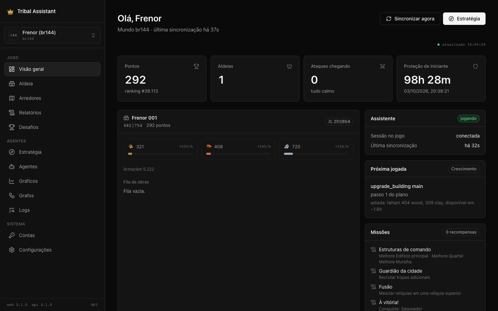
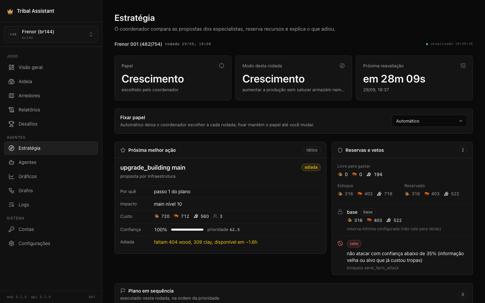
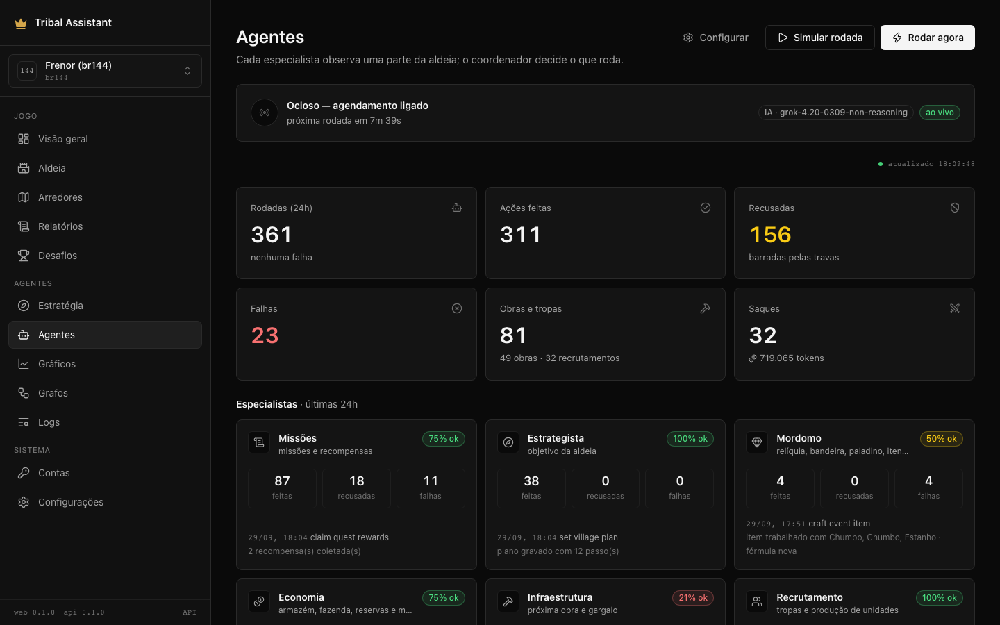
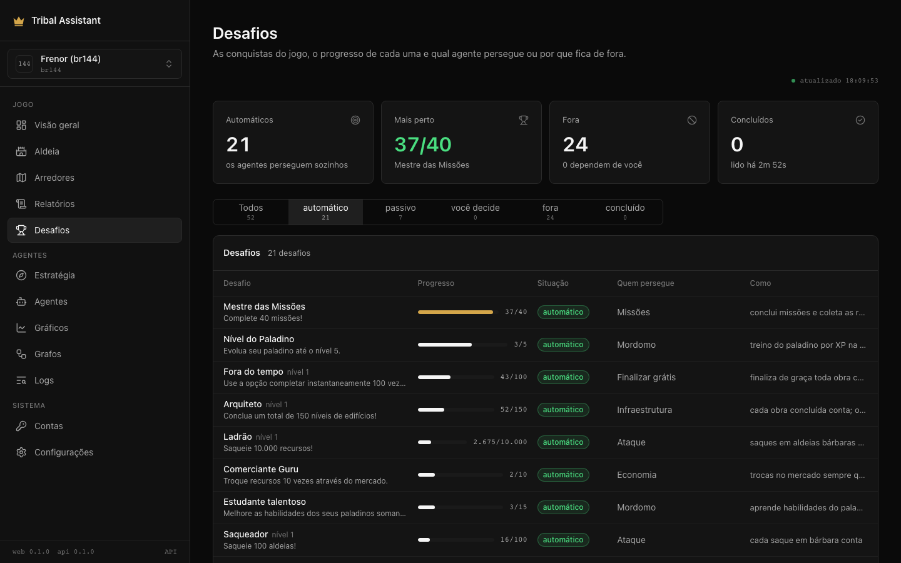
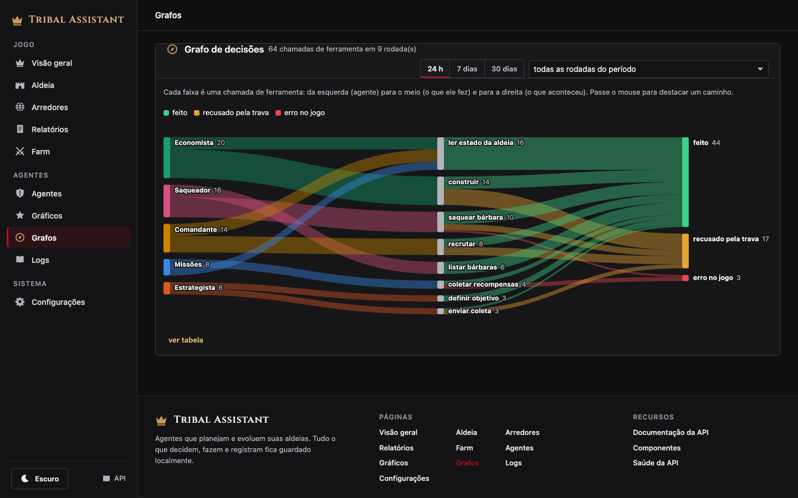
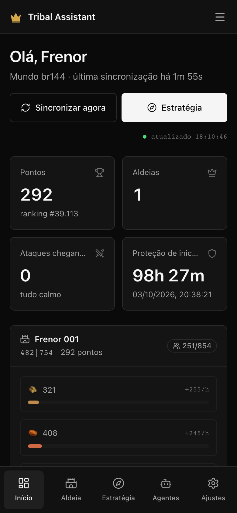

# Tribal Assistant — Tribal Wars agents, API, panel and CLI

[](https://www.python.org/)
[](https://fastapi.tiangolo.com/)
[](https://playwright.dev/python/)
[](https://www.conventionalcommits.org/en/v1.0.0/)

**Tribal Assistant** is an open-source Python assistant for the browser strategy game **Tribal Wars** (Guerra Tribal / Die Stämme). It plays your accounts through a real browser session: village agents decide builds, troops, raids, scavenging, trades, quests, the event forge, tribe and mentor, while a coordinator weighs their proposals. Everything they see and decide is stored in the database (SQLite or PostgreSQL) and shown in a Next.js panel that works on desktop and phone.

Use it as a **server** (`tribal-assistant serve` plus the panel in `apps/web`), a **CLI** (`tribal-assistant`), a **Python library** (`import tribal_assistant`) or an **MCP server** for AI clients.

| Overview | Strategy |
|----------|----------|
|  |  |

| Agents | Challenges |
|--------|------------|
|  |  |

| Charts | Decision graph |
|--------|----------------|
|  |  |

<p align="center"></p>

## Features

- **Account sync** — player, points, ranking, villages, resources and production, storage, population, troops, recruitment queue, buildings, incoming and outgoing commands, battle reports.
- **Village agents** — specialists propose, the coordinator scores and executes the best moves within the guardrails; see [Village agents](#village-agents).
- **Challenges** — reads the game achievements and chases the ones the agents can reach; combat against players, premium and account resets stay out.
- **Raids** — the attack agent picks nearby barbarian villages from the world data, sizes each squad by the average haul and skips targets that keep coming back yellow.
- **World data** — downloads the public world files and lists nearby barbarian or player villages with travel times per unit.
- **Scavenging** — shows each scavenge option, its return time and unlock state.
- **Incoming attack alerts** — highlights attacks and nobles heading to your villages.
- **Scheduler** — APScheduler jobs with jitter and configurable quiet hours.
- **Panel** — Next.js app in `apps/web`: responsive, keyboard accessible, dark theme, paginated lists, in-app confirmations.
- **REST API** — FastAPI with OpenAPI docs at `/docs`.

## Install

```bash
pip install git+https://github.com/FernandoCelmer/tribal-assistant.git
playwright install chromium
```

From a clone:

```bash
git clone https://github.com/FernandoCelmer/tribal-assistant.git
cd tribal-assistant
poetry install --extras dev   # or: make install
playwright install chromium
cp .env.example .env          # add your world URL and credentials
```

## Configuration

Settings come from environment variables or `.env`:

| Variable | Default | Purpose |
|----------|---------|---------|
| `TW_WORLD_URL` | — | World URL, e.g. `https://br144.tribalwars.com.br` |
| `TW_USERNAME` / `TW_PASSWORD` | — | Game login |
| `TW_SERVER` | `brxx` | World code |
| `DATABASE_URL` | `sqlite+aiosqlite:///./storage/tw.db` | SQLite or PostgreSQL (asyncpg) |
| `HEADLESS` | `false` | Run Chromium without a window |
| `SYNC_INTERVAL_SECONDS` | `120` | Account sync interval |
| `QUIET_HOURS` | empty | Pause syncing, e.g. `23:30-07:00` |
| `AI_PROVIDER` / `AI_MODEL` / `AI_API_KEY` / `AI_BASE_URL` | `none` | AI provider for the agents |
| `AI_MAX_TOKENS` | `2048` | Max tokens per AI answer |

See [.env.example](.env.example) for the full list.

## CLI

```bash
tribal-assistant --help
tribal-assistant serve                      # API + engine (scheduler, agents) on :8000
tribal-assistant sync                       # sync the account now
tribal-assistant status                     # player, villages, incoming attacks
tribal-assistant status --json

tribal-assistant world sync                 # download public world data
tribal-assistant world status
tribal-assistant world nearby --radius 20 --kind barbarian
```

`python -m tribal_assistant` works too.

## Library

```python
import asyncio

from tribal_assistant.core.db.session import SessionFactory, init_db
from tribal_assistant.core.services.game import GameService
from tribal_assistant.core.services.world import WorldService


async def main() -> None:
    await init_db()
    async with SessionFactory() as session:
        overview = await GameService(session).overview()
        for village in overview.villages:
            print(village.name, village.coords, village.wood, village.clay, village.iron)

        nearby = await WorldService(session).nearby(None, kind="barbarian", radius=15, limit=10)
        for target in nearby:
            print(target.coords, target.distance, target.travel_minutes.get("light"))


asyncio.run(main())
```

The FastAPI app is `tribal_assistant.api.app:app`; build your own with `tribal_assistant.api.app.create_app()`.

## Accounts and PostgreSQL

The assistant plays **several accounts at once**, each with its own browser session, data, settings, strategy and lessons. Public world data (villages, players, tribes) is stored once per world and shared.

- Add accounts on **Contas** (`/accounts`) or with `tribal-assistant accounts add --world-url https://br145.tribalwars.com.br --username NAME`. Passwords are encrypted with `APP_SECRET` (or `storage/secret.key`).
- Pick the account in the sidebar; the API takes `?account=ID`, the `X-Account` header or the `tw_account` cookie; the CLI takes `--account ID`; MCP uses `TRIBAL_ACCOUNT`.
- Pause an account from `/accounts` or `tribal-assistant accounts enable ID --off`.
- The first start creates account 1 from `TW_*` in `.env`.

Game rule: one person may own only one account per world, and accounts on the same connection must never send troops or resources to each other or to the same target. The assistant never acts between the accounts it runs; the market ignores offers from them.

**Moving to PostgreSQL** (for example on a VPS):

```bash
# on the VPS: create the database
sudo -u postgres psql -c "CREATE USER tribal WITH PASSWORD 'SENHA';" -c "CREATE DATABASE tribal OWNER tribal;"

# on the Mac: copy everything from the old SQLite (old rows become account 1)
tribal-assistant db copy --target postgresql+asyncpg://tribal:SENHA@IP_DA_VPS:5432/tribal

# then point the app at it in .env and start
DATABASE_URL=postgresql+asyncpg://tribal:SENHA@IP_DA_VPS:5432/tribal
```

Open port 5432 on the VPS only to your IP (firewall) and set `listen_addresses` and `pg_hba.conf` accordingly.

## Village agents

Each round has three stages per village:

1. **Quartermaster** hands in finished quests, claims rewards (unless storage would overflow) and opens daily chests, so free resources arrive before anything is spent.
2. **Strategist** keeps the **village plan** up to date (AI when enabled, otherwise the rule planner).
3. **Coordinator** collects structured proposals from the specialists, reserves resources, applies vetoes, ranks everything with one score and executes in order. What it did not do is recorded with the reason.

| Specialist | Observes | Delivers |
|------------|----------|----------|
| Economia | production, stock, storage, costs | storage and farm ahead of their limits, reserves, market trades of surplus |
| Infraestrutura | building levels, queue, bottlenecks | the next upgrade with its justification (plan, quest, headquarters, weakest pit) |
| Recrutamento | troops, population, recruit queues | units the plan asks for, surplus into raiding troops |
| Defesa | incoming attacks, troops, time to impact | vetoes (troops stay home, no optional spending), a defense reservation, wall and defenders |
| Ataque | barbarian targets, reports, distance, troops | raids with a confidence from report freshness, idle troops sent scavenging |
| Expansão | noble path, economy | progress to the academy; in expansion role a 30% strategic reservation |
| Conquista | nobles at home, target barbarian, scouting, cleanup, loyalty | scout, clear with offensive troops, then nobles (a train in the same second when several; one at a time until loyalty 0 otherwise) |
| Logística | surplus and full storage per village, stalled builds and academies in the other own villages | `send_resources` only between own villages of the same account, noble packages first |
| Inteligência | reports, targets, neighbours | labelled insights (fact, estimate, hypothesis) and missing or stale data |
| Mordomo | relics, flags, paladin, inventory | production relic and best flag assigned, paladin skills and XP training, items used at the right time |

**How the coordinator decides**

- **Role and mode.** Each village has a role (growth, defense, offensive, support, expansion). It is derived from progress or fixed by you on `/strategy`; an incoming attack switches the round to *emergency* until the impact.
- **Proposal format.** Every proposal carries action, arguments, reason, expected benefit, cost, troops, horizon (immediate, tactical, strategic), deadline, confidence, dependencies and risks.
- **Priority.** `urgency + impact + risk avoided + opportunity − opportunity cost − uncertainty`, with weights that change with the mode (in emergency, urgency and risk dominate; in growth, economic return does).
- **Reservations.** Defense, strategic goal, the next plan build (when affordable within 1.5 h) and the configured base reserve. "Available" means free after reservations; only the owner of a reservation may spend it.
- **Hard vetoes.** Troops committed to an imminent defense never leave; no optional spending that would break an approved defense; no raid below 35% confidence (old or bad information); no repeating an action whose confirmation has not arrived yet; repeated identical failures are refused by the lessons.
- **Limits by role.** Reserve, recruit budget, raid radius and pace, and the retarget interval come from the village role (growth, defense, offensive, support, expansion, emergency), not from settings. `dry_run` works as a pure diagnosis mode.
- **Horizons and review.** Each round stores the next review time: the earliest of a deferred proposal becoming affordable, the build queue ending, storage filling or an attack landing.

- **Account roles.** With two or more villages the account shares roles out: the most exposed village defends (or supports), the one with an academy expands and the farthest one with a stable raids. The village's own alarm (danger, another village under attack) still wins, and the usual hysteresis applies before a switch.

New villages are picked up automatically after the next sync.

**AI plans, rules execute.** Only the Strategist calls the model: it writes a **village plan** (up to 12 ordered steps — build X to level N, recruit, unlock scavenging) with `set_village_plan`. The other agents execute the plan with rules, at zero token cost. The plan is rewritten only when it is missing, older than `plan_refresh_minutes`, finished or stuck, so the model runs a few times a day instead of five times per round. Without an AI key the same plan comes from a built-in rule planner (quests, balanced production, path to the first nobleman).

Plan progress is measured from the real village state every round (pending, queued, done, blocked) and shown on `/agents`.

Token savings: role-sliced compact text context instead of full JSON, no duplicate state reads, short answers (`AI_MAX_TOKENS`, default 2048), a cap on tool loops (`llm_max_steps`), and `llm_agents` to choose which agents may call the model (default: only the Strategist).

Every action passes the same **guardrails**, enforced in code.

The schedule and AI options are **runtime settings** stored in the database, not `.env`. Change them from the **Configurações** page (`/settings`), the API (`PATCH /api/v1/agents/settings`), the CLI (`tribal-assistant agents set …`) or MCP (`update_agent_settings`). A running server picks up changes within a minute, with no restart.

| Setting | Default | Meaning |
|---------|---------|---------|
| `enabled` | `false` | run on a schedule inside `tribal-assistant serve` |
| `interval_minutes` | `10` | minutes between scheduled rounds |
| `dry_run` | `false` | simulate and log without touching the game |
| `auto_finish_free` | `true` | click the free "finish now" button on short builds (never paid ones) |
| `llm_agents` | `["strategist"]` | agents allowed to call the AI |
| `plan_refresh_minutes` | `360` | minutes before the strategist rewrites the plan (free with rules; one AI call when AI is on) |
| `llm_max_steps` | `6` | tool rounds per AI conversation |

Every decision, including refusals, is stored with its reason and shown in the panel.

```bash
tribal-assistant agents run --dry-run                   # simulate a round
tribal-assistant agents run --live                      # act in the game
tribal-assistant agents log                             # what they did and why
tribal-assistant agents config                          # brain + current settings
tribal-assistant agents set enabled=true interval_minutes=15
tribal-assistant quests                                 # quests and pending rewards
```

## Docs library

Everything under `docs/` (official help, guides, forum tutorials saved locally) is loaded into the database one section per row and searched with PostgreSQL full-text search in Portuguese: accents ignored, title words weigh most, common synonyms of the game expanded (requisitos/requerimentos, custo/preço, tropas/unidades). SQLite falls back to a plain word search.

```bash
tribal-assistant docs sync                     # load docs/ into the database (only changed files)
tribal-assistant docs search "custo da academia"
```

The server reloads `docs/` every 6 hours. The strategist and the MCP clients use `search_docs` (best sections with the document path) and `read_doc` (a whole document); the API serves `/api/v1/docs/search`, `/read`, `/catalog` and `/sync`. Folders named `raw` and `screenshots` are skipped.

## AI providers

| `AI_PROVIDER` | Key variable | Default model | Endpoint |
|---------------|--------------|---------------|----------|
| `anthropic` | `ANTHROPIC_API_KEY` | `claude-opus-5` | Anthropic SDK |
| `openai` | `OPENAI_API_KEY` | `gpt-5` | OpenAI SDK |
| `grok` | `XAI_API_KEY` | `grok-4.20-0309-non-reasoning` | `https://api.x.ai/v1` |
| `gemini` | `GEMINI_API_KEY` | `gemini-2.5-pro` | Gemini OpenAI-compatible endpoint |
| `vertex` | `GOOGLE_API_KEY` | `gemini-2.5-flash` | Gemini on Vertex AI with an express-mode API key (native generateContent) |
| `ollama` | none | `llama3.1` | `http://localhost:11434/v1` |
| `openai-compatible` | `OPENAI_API_KEY` | set `AI_MODEL` | set `AI_BASE_URL` |

`AI_API_KEY`, `AI_MODEL` and `AI_BASE_URL` override the defaults. New providers implement the `LLM` and `Conversation` abstract classes in `tribal_assistant/ai/abc/llm.py`.

## MCP server

```bash
pip install tribal-assistant
tribal-assistant mcp            # stdio, for Claude Code / Claude Desktop / Codex (needs the server running)
tribal-assistant mcp --http     # streamable HTTP on 127.0.0.1:8765
```

The repository ships a `.mcp.json`, so Claude Code picks the server up when opened in this folder. It exposes 26 tools and 5 prompts (`grow_village`, `farm_round`, `first_noble_plan`, `agent_round`, `daily_routine`), including `get_coordination` and `set_village_role`:

- **read-only:** `get_overview`, `get_village_state`, `get_quests`, `get_plans`, `get_coordination`, `get_agent_decisions`, `get_agents_config`, `lookup_knowledge`, `get_world_status`, `list_nearby`, `list_barbarians`
- **game actions:** `upgrade_building`, `recruit_units`, `send_farm_attack`, `send_scavenge`, `unlock_scavenge`, `claim_quest_rewards`, `complete_quest`, `open_daily_bonus` and `run_agents`. They pass the guardrails and default to `dry_run=true`.
- **other:** `sync_account`, `sync_world`, `set_village_goal`, `set_village_plan`, `set_village_role`, `update_agent_settings`

## Panel and API

```bash
tribal-assistant serve     # API and engine on :8000
make web-install && make web   # Next.js panel on :3000, proxies /api/v1 to TRIBAL_API (default http://127.0.0.1:8000)
make web-types             # regenerate the panel types from the API's OpenAPI schema
```

`WEB_PASSWORD` (and `WEB_USER`, default `admin`) puts the whole panel behind a password; leave it unset locally.

Each topic is its own page, reached from the sidebar (a drawer on phones):

| Page | What it shows |
|------|---------------|
| `/` Visão geral | whether the server plays, account, village resources, next move of the coordinator, scavenging, quests, troop movements |
| `/village` | troops and buildings |
| `/nearby` | nearby villages with travel times |
| `/reports` | battle reports with loot |
| `/challenges` | the game achievements: progress, which agent chases each one, and which stay out (combat against players, social, premium) |
| `/strategy` | per village: role and mode, next best action with reason, cost and confidence, the executed sequence, deferred proposals and why, reservations, vetoes, insights, the specialists |
| `/agents` | live status of the agents, decisions per round (done vs deferred by reason, what blocks the most), village plan, rounds, live feed; `/agents/<run>` explains one round: specialist → decision → result, why each proposal was deferred, the round budget, and the full reasoning |
| `/charts` | agent metrics (actions per hour, refusals, tokens), tool graph (agents → tools → results; `/graph` redirects here) and village evolution |
| `/logs` | application logs with live tail |
| `/settings` | runtime settings, AI status (provider, model, key present, never the key) and system info |

Everything shown there is stored in the database: rounds (`agent_runs`), every reasoning step and tool call (`agent_steps`), decisions (`agent_decisions`), village snapshots at every sync (`village_snapshots`) and application logs (`app_logs`). Live updates arrive over Server-Sent Events at `/api/v1/events`. OpenAPI docs are at `/docs`.

## Deploy (Dokploy)

`deploy/docker-compose.dokploy.yml` builds two services from this repository:

| Service | Image | Exposed |
|---------|-------|---------|
| `api` | `deploy/Dockerfile.api`: Python, the engine, headless Chromium | internal only (port 8000) |
| `web` | `deploy/Dockerfile.web`: Next.js standalone | give it the domain (port 3000) |

In Dokploy: create a **Compose** service from the Git repository, set the compose path to `./deploy/docker-compose.dokploy.yml`, fill the environment from `deploy/.env.example`, add a domain on `web` port `3000` and deploy.

| Variable | Why |
|----------|-----|
| `DATABASE_URL` | the PostgreSQL database (`postgresql+asyncpg://...`) |
| `APP_SECRET` | the key that decrypts the stored game passwords: the content of `storage/secret.key` from the machine that created the accounts |
| `WEB_PASSWORD` | the panel asks for it (HTTP basic auth, user `WEB_USER`, default `admin`) |
| `AI_*`, `QUIET_HOURS` | same as the local `.env` |

The API is reached only through the web service, which proxies `/api/v1`, `/docs` and `/openapi.json` behind the same password. `storage/` (browser state, captures) lives in the `storage` volume.

Only one server may play an account. `PLAY=false` turns a server into a panel: no scheduler, no agents, no game browser (actions that need the game answer 409). Keep `PLAY=true` on the server that plays (the default) and `PLAY=false` on the others, for example play on your machine and set `PLAY=false` on the VPS.

## Architecture

Four layers, each depending only on the one below:

```
web ─┐
     ├─► api ──► core
mcp ─┘  (HTTP)
cli ───────────► core
```

| Layer | Package | Responsibility |
|-------|---------|----------------|
| **core** | `tribal_assistant/core` | The library and the engine: accounts, browser sessions and game actions (`game`), village agents and the coordinator (`agents`), AI providers (`ai`), database models and repositories (`models`, `repositories`, `db`), use cases (`services`), the scheduler and `runtime.Engine`. All rules and decisions live here. No web framework imports. |
| **api** | `tribal_assistant/api` | FastAPI bridge over the core: resolves the account per request, opens the session, builds core services, translates errors to JSON. |
| **web** | `apps/web` | Next.js panel. Server components read `/api/v1`; the middleware proxies the API and guards the panel with `WEB_PASSWORD`. |
| **mcp** | `tribal_assistant/mcp` | MCP server that only talks to the API over HTTP (`TRIBAL_API_URL`, account from `TRIBAL_ACCOUNT`). The server must be running. |
| **cli** | `tribal_assistant/cli.py` | Terminal commands on top of the core library. |

`tests/test_architecture.py` fails if a layer imports one it should not (for example FastAPI in `core`, or `core` in `mcp`).

```
tribal_assistant/
├── core/
│   ├── accounts/       account context and registry
│   ├── agents/         quests and plan agents, coordinator, proposers, tools, guardrails, learning
│   ├── ai/             provider-neutral LLM layer
│   ├── game/           Playwright session per account, actions, scrapers, sync, screen capture
│   ├── db/ models/ repositories/   engine, ORM models (scoped by account and world), data access
│   ├── schemas/        Pydantic contracts shared with the API
│   ├── services/       use cases called by the API and the CLI
│   ├── scheduler/      jobs run per account
│   └── runtime.py      Engine: start and stop everything in the background
├── api/                FastAPI app, dependencies, routers (v1), errors
├── mcp/                MCP server, HTTP client, tool groups, prompts, resources
└── cli.py              Typer CLI
```

## Development

```bash
make test        # pytest
make lint        # ruff
make typecheck   # mypy
make web-check   # panel type check and build
```

Commits follow [Conventional Commits](https://www.conventionalcommits.org/en/v1.0.0/).

## Disclaimer

Tribal Assistant is an unofficial project and is not affiliated with InnoGames. Automating actions may break the game rules of your server; you are responsible for how you use it. Try it on a test account first.
