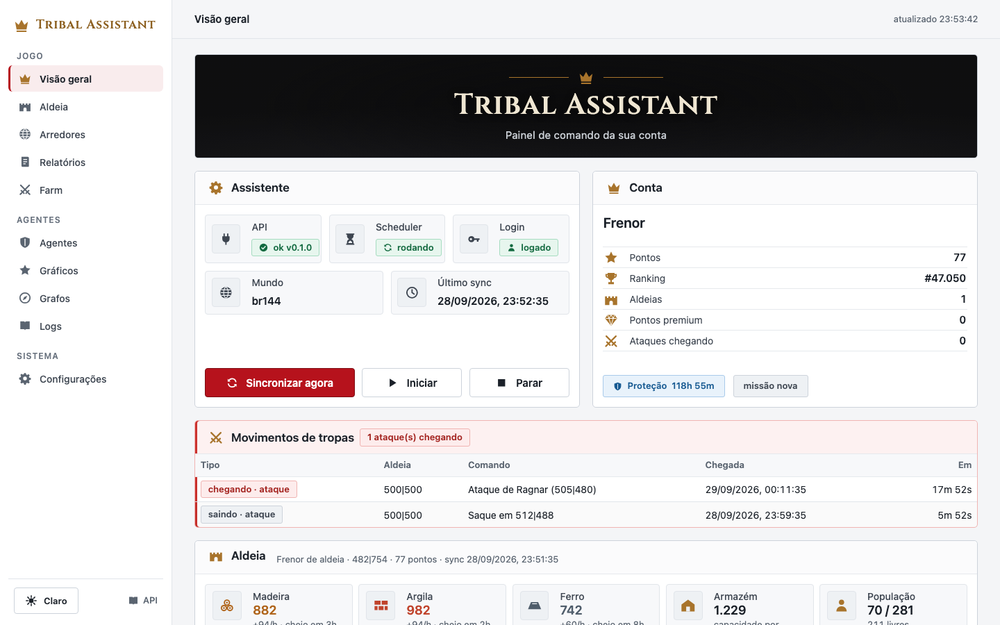
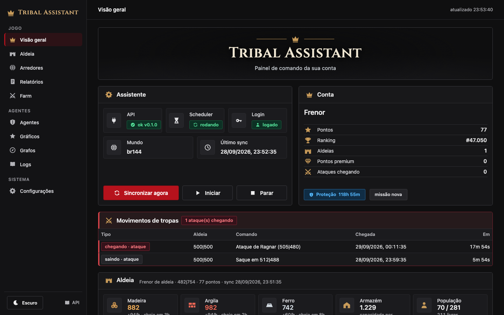
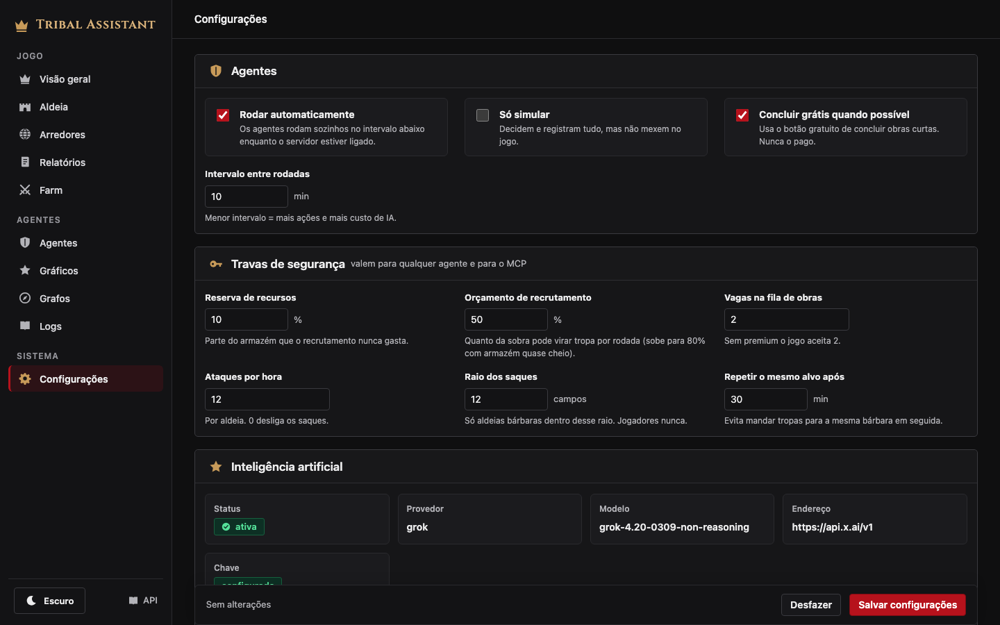

# Tribal Assistant — Tribal Wars assistant, CLI and web dashboard

[](https://www.python.org/)
[](https://fastapi.tiangolo.com/)
[](https://playwright.dev/python/)
[](https://www.conventionalcommits.org/en/v1.0.0/)

**Tribal Assistant** is an open-source Python assistant for the browser strategy game **Tribal Wars** (Guerra Tribal / Die Stämme). It syncs your account through a real browser session, stores villages, resources, troops, buildings, commands and reports in a local database, recommends what to build next, finds barbarian villages to farm, and shows everything in a medieval-themed web dashboard with light and dark mode.

Use it three ways: as a **CLI** (`tribal-assistant`), as a **Python library** (`import tribal_assistant`), or as a **FastAPI server** with a dashboard.

| Light | Dark |
|-------|------|
|  |  |

| Agents | Settings |
|--------|----------|
|  |  |

| Decision graph | Charts |
|----------------|--------|
|  |  |

## Features

- **Account sync** — player, points, ranking, villages, resources and production, storage, population, troops, recruitment queue, buildings, incoming and outgoing commands, battle reports.
- **Build advisor** — ranks the next building upgrades by priority, cost and time until resources are available.
- **Farm assistant** — farm targets with templates A/B/C, wall level tracking and scheduled farm ticks.
- **World data** — downloads the public world files and lists nearby barbarian or player villages with travel times per unit.
- **Scavenging** — shows each scavenge option, its return time and unlock state.
- **Incoming attack alerts** — highlights attacks and nobles heading to your villages.
- **Scheduler** — APScheduler jobs with jitter and configurable quiet hours.
- **Dashboard** — responsive web UI, keyboard accessible, light theme and graphite dark theme, component docs at `/componentes`.
- **REST API** — FastAPI with OpenAPI docs at `/docs`.

## Install

```bash
pip install git+https://github.com/FernandoCelmer/tribal-assistant.git
playwright install chromium
```

From a clone:

```bash
git clone https://github.com/FernandoCelmer/tribal-assistant.git
cd tribal-assistant
poetry install --extras dev   # or: make install
playwright install chromium
cp .env.example .env          # add your world URL and credentials
```

## Configuration

Settings come from environment variables or `.env`:

| Variable | Default | Purpose |
|----------|---------|---------|
| `TW_WORLD_URL` | — | World URL, e.g. `https://br144.tribalwars.com.br` |
| `TW_USERNAME` / `TW_PASSWORD` | — | Game login |
| `TW_SERVER` | `brxx` | World code |
| `DATABASE_URL` | `sqlite+aiosqlite:///./storage/tw.db` | SQLite or PostgreSQL (asyncpg) |
| `HEADLESS` | `false` | Run Chromium without a window |
| `SYNC_INTERVAL_SECONDS` | `120` | Account sync interval |
| `QUIET_HOURS` | empty | Pause syncing, e.g. `23:30-07:00` |
| `AI_PROVIDER` / `AI_MODEL` / `AI_API_KEY` / `AI_BASE_URL` | `none` | AI provider for the agents |
| `AI_MAX_TOKENS` | `2048` | Max tokens per AI answer |
| `FARM_ENABLED` | `true` | Enable farm ticks |

See [.env.example](.env.example) for the full list.

## CLI

```bash
tribal-assistant --help
tribal-assistant serve                      # API + dashboard + scheduler on :8000
tribal-assistant sync                       # sync the account now
tribal-assistant status                     # player, villages, incoming attacks
tribal-assistant status --json

tribal-assistant world sync                 # download public world data
tribal-assistant world status
tribal-assistant world nearby --radius 20 --kind barbarian

tribal-assistant farm list --all
tribal-assistant farm add "512|488" --template B --wall 1
tribal-assistant farm remove 3
tribal-assistant farm tick
```

`python -m tribal_assistant` works too.

## Library

```python
import asyncio

from tribal_assistant.db.session import SessionFactory, init_db
from tribal_assistant.services.game import GameService
from tribal_assistant.services.world import WorldService


async def main() -> None:
    await init_db()
    async with SessionFactory() as session:
        overview = await GameService(session).overview()
        for village in overview.villages:
            print(village.name, village.coords, village.wood, village.clay, village.iron)

        nearby = await WorldService(session).nearby(None, kind="barbarian", radius=15, limit=10)
        for target in nearby:
            print(target.coords, target.distance, target.travel_minutes.get("light"))


asyncio.run(main())
```

The FastAPI app is `tribal_assistant.server:app`; build your own with `tribal_assistant.server.create_app()`.

## Village agents

Each round has three stages per village:

1. **Quartermaster** hands in finished quests, claims rewards (unless storage would overflow) and opens daily chests, so free resources arrive before anything is spent.
2. **Strategist** keeps the **village plan** up to date (AI when enabled, otherwise the rule planner).
3. **Coordinator** collects structured proposals from eight specialists, reserves resources, applies vetoes, ranks everything with one score and executes in order. What it did not do is recorded with the reason.

| Specialist | Observes | Delivers |
|------------|----------|----------|
| Economia | production, stock, storage, costs | storage and farm ahead of their limits, reserves, market trades of surplus |
| Infraestrutura | building levels, queue, bottlenecks | the next upgrade with its justification (plan, quest, headquarters, weakest pit) |
| Recrutamento | troops, population, recruit queues | units the plan asks for, surplus into raiding troops |
| Defesa | incoming attacks, troops, time to impact | vetoes (troops stay home, no optional spending), a defense reservation, wall and defenders |
| Ataque | barbarian targets, reports, distance, troops | raids with a confidence from report freshness, idle troops sent scavenging |
| Expansão | noble path, economy | progress to the academy; in expansion role a 30% strategic reservation |
| Inteligência | reports, targets, neighbours | labelled insights (fact, estimate, hypothesis) and missing or stale data |
| Mordomo | relics, flags, paladin, inventory | production relic and best flag assigned, paladin skills and XP training, items used at the right time |

**How the coordinator decides**

- **Role and mode.** Each village has a role (growth, defense, offensive, support, expansion). It is derived from progress or fixed by you on `/estrategia`; an incoming attack switches the round to *emergency* until the impact.
- **Proposal format.** Every proposal carries action, arguments, reason, expected benefit, cost, troops, horizon (immediate, tactical, strategic), deadline, confidence, dependencies and risks.
- **Priority.** `urgency + impact + risk avoided + opportunity − opportunity cost − uncertainty`, with weights that change with the mode (in emergency, urgency and risk dominate; in growth, economic return does).
- **Reservations.** Defense, strategic goal, the next plan build (when affordable within 1.5 h) and the configured base reserve. "Available" means free after reservations; only the owner of a reservation may spend it.
- **Hard vetoes.** Troops committed to an imminent defense never leave; no optional spending that would break an approved defense; no raid below 35% confidence (old or bad information); no repeating an action whose confirmation has not arrived yet; repeated identical failures are refused by the lessons.
- **Approval.** Actions listed in `approval_actions` are only proposed; they wait on `/estrategia` for an *Aprovar* click. `dry_run` works as a pure diagnosis mode.
- **Horizons and review.** Each round stores the next review time: the earliest of a deferred proposal becoming affordable, the build queue ending, storage filling or an attack landing.

New villages are picked up automatically after the next sync.

**AI plans, rules execute.** Only the Strategist calls the model: it writes a **village plan** (up to 12 ordered steps — build X to level N, recruit, unlock scavenging) with `set_village_plan`. The other agents execute the plan with rules, at zero token cost. The plan is rewritten only when it is missing, older than `plan_refresh_minutes`, finished or stuck, so the model runs a few times a day instead of five times per round. Without an AI key the same plan comes from a built-in rule planner (quests, advisor, balanced production, path to the first nobleman).

Plan progress is measured from the real village state every round (pending, queued, done, blocked) and shown on `/agentes`.

Token savings: role-sliced compact text context instead of full JSON, no duplicate state reads, short answers (`AI_MAX_TOKENS`, default 2048), a cap on tool loops (`llm_max_steps`), and `llm_agents` to choose which agents may call the model (default: only the Strategist).

Every action passes the same **guardrails**, enforced in code.

The guardrails and the schedule are **runtime settings** stored in the database, not `.env`. Change them from the **Configurações** page (`/configuracoes`), the API (`PATCH /api/v1/agents/settings`), the CLI (`tribal-assistant agents set …`) or MCP (`update_agent_settings`). A running server picks up changes within a minute, with no restart.

| Setting | Default | Meaning |
|---------|---------|---------|
| `enabled` | `false` | run on a schedule inside `tribal-assistant serve` |
| `interval_minutes` | `10` | minutes between scheduled rounds |
| `dry_run` | `false` | simulate and log without touching the game |
| `resource_reserve` | `0.1` | share of storage recruiting never spends |
| `recruit_budget` | `0.5` | share of spare resources recruiting may use per round |
| `max_attacks_per_hour` | `12` | attacks per village per hour |
| `attack_radius` | `12` | max distance to a barbarian target (players are never targeted) |
| `retarget_minutes` | `30` | wait before hitting the same village again |
| `build_queue_slots` | `2` | build orders agents may keep queued |
| `auto_finish_free` | `true` | click the free "finish now" button on short builds (never paid ones) |
| `llm_agents` | `["strategist"]` | agents allowed to call the AI |
| `plan_refresh_minutes` | `360` | minutes before the strategist rewrites the plan (free with rules; one AI call when AI is on) |
| `llm_max_steps` | `6` | tool rounds per AI conversation |
| `approval_actions` | `[]` | actions the coordinator only proposes, waiting for approval on `/estrategia` |

Every decision, including refusals, is stored with its reason and shown in the dashboard.

```bash
tribal-assistant agents run --dry-run                   # simulate a round
tribal-assistant agents run --live                      # act in the game
tribal-assistant agents log                             # what they did and why
tribal-assistant agents config                          # brain + current settings
tribal-assistant agents set enabled=true interval_minutes=15
tribal-assistant quests                                 # quests and pending rewards
```

## AI providers

| `AI_PROVIDER` | Key variable | Default model | Endpoint |
|---------------|--------------|---------------|----------|
| `anthropic` | `ANTHROPIC_API_KEY` | `claude-opus-5` | Anthropic SDK |
| `openai` | `OPENAI_API_KEY` | `gpt-5` | OpenAI SDK |
| `grok` | `XAI_API_KEY` | `grok-4.20-0309-non-reasoning` | `https://api.x.ai/v1` |
| `gemini` | `GEMINI_API_KEY` | `gemini-2.5-pro` | Gemini OpenAI-compatible endpoint |
| `ollama` | none | `llama3.1` | `http://localhost:11434/v1` |
| `openai-compatible` | `OPENAI_API_KEY` | set `AI_MODEL` | set `AI_BASE_URL` |

`AI_API_KEY`, `AI_MODEL` and `AI_BASE_URL` override the defaults. New providers implement the `LLM` and `Conversation` abstract classes in `tribal_assistant/ai/abc/llm.py`.

## MCP server

```bash
pip install "tribal-assistant[mcp]"
tribal-assistant mcp            # stdio, for Claude Code / Claude Desktop / Codex
tribal-assistant mcp --http     # streamable HTTP on 127.0.0.1:8765
```

The repository ships a `.mcp.json`, so Claude Code picks the server up when opened in this folder. It exposes 29 tools and 5 prompts (`grow_village`, `farm_round`, `first_noble_plan`, `agent_round`, `daily_routine`), including `get_coordination` and `set_village_role`:

- **read-only:** `get_overview`, `get_quests`, `get_plans`, `get_agent_decisions`, `get_agents_config`, `lookup_knowledge`, `get_world_status`, `list_nearby`, `list_farm_targets`
- **game actions:** `upgrade_building`, `recruit_units`, `send_farm_attack`, `claim_quest_rewards`, `complete_quest` and `run_agents`. They pass the guardrails and default to `dry_run=true`.
- **other:** `sync_account`, `sync_world`, `add_farm_target`, `remove_farm_target`, `set_village_goal`, `update_agent_settings`

## Web dashboard and API

```bash
tribal-assistant serve
```

Each topic is its own page, reached from the sidebar (a drawer on phones):

| Page | What it shows |
|------|---------------|
| `/` Visão geral | assistant status, account, village resources, what to upgrade, scavenging, quests, troop movements |
| `/aldeia` | troops and buildings |
| `/arredores` | nearby villages, add farm targets |
| `/relatorios` | battle reports with loot |
| `/farm` | farm targets |
| `/estrategia` | per village: role and mode, next best action with reason, cost and confidence, the executed sequence, deferred proposals and why, reservations, vetoes, insights, the specialists |
| `/agentes` | live status of the agents, village plan, rounds, the full reasoning of each round, live feed |
| `/graficos` | agent metrics (actions per hour, refusals, tokens) and village evolution |
| `/grafos` | decision graph: agents → tools → results |
| `/logs` | application logs with live tail |
| `/configuracoes` | runtime settings, AI status (provider, model, key present, never the key) and system info |

Everything shown there is stored in the database: rounds (`agent_runs`), every reasoning step and tool call (`agent_steps`), decisions (`agent_decisions`), village snapshots at every sync (`village_snapshots`) and application logs (`app_logs`). Live updates arrive over Server-Sent Events at `/api/v1/events`. OpenAPI docs are at `/docs`.

## Architecture

```
tribal_assistant/
├── cli.py            Typer CLI
├── agents/           village agents: roles, brains, tools, toolbox, guardrails, knowledge
├── ai/               provider-neutral LLM layer (abstract classes + providers)
├── mcp/              MCP server, tool groups, prompts
├── server.py         FastAPI factory, lifespan, dashboard routes
├── api/              HTTP routers (v1)
├── services/         domain logic: game, world, farm, advisor, assistant
├── repositories/     SQLAlchemy async data access
├── models/           ORM models
├── schemas/          Pydantic input/output
├── client/           Playwright session, login, game actions, scrapers, sync
├── scheduler/        APScheduler runtime and jobs
├── db/               engine, session factory, init_db
└── web/              dashboard (HTML, CSS design system, icons)
```

Layers: `api → services → repositories → models`. Scrapers are pure functions (HTML in, data out) and are tested with saved fixtures.

## Development

```bash
make test        # pytest
make lint        # ruff
make typecheck   # mypy
make migrate     # alembic upgrade head
```

Commits follow [Conventional Commits](https://www.conventionalcommits.org/en/v1.0.0/).

## Disclaimer

Tribal Assistant is an unofficial project and is not affiliated with InnoGames. Automating actions may break the game rules of your server; you are responsible for how you use it. Try it on a test account first.
